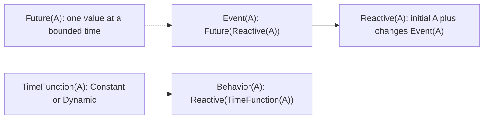
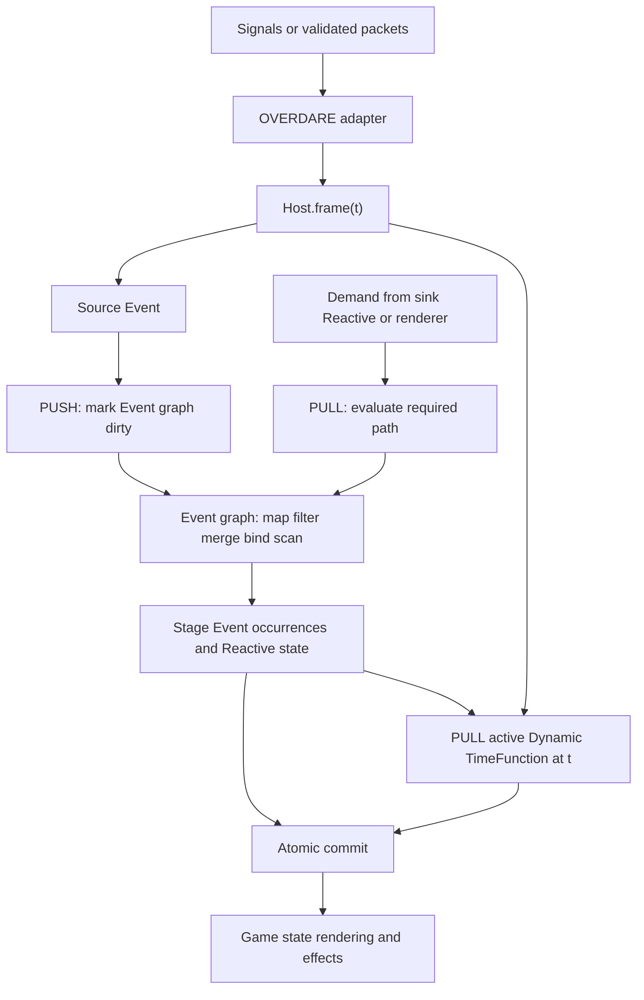

# Push-Pull FRP 아키텍처

## 한눈에 보는 구조

### 타입 정규형



### 한 frame의 Push-Pull 실행



핵심은 source가 값을 밀어 넣을 때 사용자 mapper를 즉시 실행하지 않는다는 점이다. push는 Event graph에 변경 가능성만 전파하고, subscription이나 Reactive가 요구한 경로만 pull해서 frame당 한 번 평가한다. `Behavior<A>`는 `Reactive<TimeFunction<A>>`이므로 phase 변경은 Event/Reactive 경로를 따르고, 활성 phase가 `Dynamic`일 때만 정확한 시각 `t`로 연속 값을 pull한다. 모든 준비가 성공해야 occurrence와 history가 함께 commit된다.

## Denotation이 먼저다

Core의 기준은 scheduler 구현이 아니라 다음 관찰 함수다.

```text
force  : Future<A>   -> (BoundTime, A)
occs   : Event<A>    -> ordered [(BoundTime, A)]
rat    : Reactive<A> -> Time -> A
at     : Behavior<A> -> Time -> A
```

`rat(stepper(a0, e), t)`는 `e`에서 `occurrenceTime < t`인 마지막 값을 고른다. Event merge는 시간순이며 tie는 왼쪽 occurrence 전체가 먼저다. 이 규칙이 public method, sink, history reconstruction, OVERDARE batching보다 우선한다.

## 실행 흐름

```text
OVERDARE Signal / timer / network arrival
  -> timestamped source queue                         push
  -> Host:frame(time) barrier
  -> source Event가 dependent Event를 dirty 표시      push
  -> 요구된 sink와 Reactive만 Event graph 평가         pull discrete prefix
  -> Reactive change와 Event occurrence 원자 commit
  -> active Behavior phase 선택
  -> Dynamic TimeFunction만 sample time에 평가         pull continuous value
  -> sink delivery
```

Event node는 dependency와 frame memo를 가진다. source push는 mapper를 즉시 실행하지 않고 dirty 상태만 전달한다. sink나 Reactive가 해당 occurrence를 요구할 때 graph를 pull한다. 한 frame에서 각 node는 한 번 평가된다.

## 과거 prefix와 동적 Event

Event Monad의 `bind`는 새 inner Event가 선택되기 전에 이미 발생한 occurrence도 버리지 않는다.

```text
outer @ 5
inner @ 3
result @ max(5, 3) = 5
```

strict Luau runtime은 source Event의 닫힌 prefix를 보존하고, `map/filter/merge/scan/bind`가 필요할 때 그 prefix를 조합자별로 재구성한다. stateful 조합자의 catch-up은 frame commit에 stage되어 평가 실패 시 state가 바뀌지 않는다. 진단용 과거 cutoff pull은 operational state를 commit하지 않는다. 이미 active한 stream은 incremental frame memo를 사용한다.

이 방식은 Haskell lazy list를 복제하지 않으면서 Event denotation과 dormant graph의 demand-driven 실행을 함께 유지한다.

## 원자 frame

Host frame은 다음 순서다.

```text
collect roots
  -> prepare Event/Reactive/Behavior 결과
  -> prepare 성공 시 source prefix와 state를 commit
  -> Event sink와 renderer sink 전달
```

mapper, reducer, predicate, validator 성격의 사용자 callback은 prepare 안에서 동기식으로 실행된다. 오류나 yield가 발생하면 Host time, source prefix, Reactive current/history, stateful Event state를 commit하지 않는다. commit 이후 sink 오류는 다른 sink를 막지 않고 Host error channel로 격리한다.

### 불변 occurrence와 opt-in capture

Event history, Reactive history, sink가 공유하는 occurrence envelope은 생성 즉시 freeze한다. 배열 복사만으로 내부 record를 노출하지 않으며, 어느 observer도 기록된 time/order/value slot을 다시 쓸 수 없다.

payload 자체는 generic `T`라 전역 clone/freeze하지 않는다. 함수, Instance, TimeFunction과 FRP graph handle의 identity를 깨뜨릴 수 있기 때문이다. Core의 기본 경로는 zero-copy + 비수정 계약이고, plain-data 경계만 `capture` hook으로 분리한다.

```text
external mutable table
  -> source/pure/once/Future conversion/fromOccurrences capture
  -> detached retained payload
  -> frozen occurrence envelope
```

`Immutable.serializable()`은 default codec clone 뒤 table graph를 재귀적으로 freeze한다. shared alias는 유지하지만 custom codec 결과까지 포함해 metatable은 거부하며, default codec은 cycle, 함수와 Instance도 거부한다. `scan` capture 경로는 committed state를 reducer에 직접 넘기지 않고 working copy를 만든 뒤, reducer가 성공한 결과만 다시 capture해 stage한다. 따라서 reducer가 working copy를 수정한 뒤 오류를 내도 이전 committed state는 그대로다.

동일 logical time에 들어올 수 있는 모든 외부 root는 frame callback 하나에 모아야 한다. 예약된 root도 barrier가 같은 time의 callback root와 합친다. 한 번 commit한 time은 재개방하지 않는다. `Event:merge`의 tie order는 root callback 도착 순서가 아니라 graph의 왼쪽/오른쪽 구조로 결정된다.

## Behavior renderer

```text
TimeFunction<A> = Constant(A) | Dynamic(Time -> A)
Behavior<A>     = Reactive<TimeFunction<A>>
```

Constant phase는 phase 진입 시 한 번만 렌더한다. Dynamic phase는 Host가 앞으로 advance할 때 현재 time으로 pull한다. 새 phase occurrence가 오면 이전 dynamic renderer를 논리적으로 교체한다. 한 frame의 모든 phase occurrence와 같은-object duplicate도 순서대로 렌더한다. 순수 `Behavior:at(t)`는 strict-before라 정확한 switch time에는 이전 phase를 사용하고, renderer callback은 commit 뒤 활성화된 새 phase를 뜻한다.

## graph ownership

Event child는 parent를 strong reference하고 parent의 dependent edge는 weak-key다. 따라서 sink/Reactive/사용자 handle에서 도달 가능한 graph만 push 경로로 남고, 버린 downstream graph는 수거된다. Host dispose는 모든 추적 Event/Reactive의 edge, callback closure, source prefix와 history를 비운다. 살아 있는 Host의 prefix/history는 임의의 과거 inner를 허용하는 Event Monad 의미론 때문에 자동 truncate하지 않는다.

## Improving/unamb를 직접 이식하지 않은 이유

논문 구현의 `Improving`과 `unamb`는 Haskell laziness, bottom, `unsafePerformIO`, preemptive thread race와 kill에 의존한다. Luau coroutine은 strict·협력형이라 같은 연산을 generic pure function으로 안전하게 제공할 수 없다.

대신 Host 경계가 다음 정보를 명시한다.

- source의 exact finite timestamp
- 앞으로만 움직이는 frontier
- 같은 time의 root가 더 오지 않는 frame barrier
- 예약 Future의 정렬된 timestamp

따라서 task 완료 속도로 tie를 정하지 않으며, merge tree의 구조적 왼쪽 우선이 항상 결과를 결정한다. generic public `unamb`나 “아직 모르는 Future 중 더 이른 것”의 비결정적 race API는 제공하지 않는다.

## 모듈 경계

```text
src/init.luau                 FRP root와 version metadata
src/Core/FRP.luau            Future/Event/Reactive/TimeFunction/Behavior/Host
src/Core/Runtime.luau        기존 StateRuntime 호환 계층
src/Core/Clock.luau          기존 fixed/manual state clock
src/Core/Codec.luau          serializable data codec
src/Core/Hash.luau           canonical state hash
src/Core/Immutable.luau      opt-in clone/freeze capture policy

src/Overdare/init.luau       batched FRP driver + FRP RemoteEvent/State adapters
src/Network/init.luau        StateRuntime snapshot/patch + FRP protocol facade
src/Network/EventProtocol.luau  intent/authority/ack/replay/snapshot epoch
src/Bridge/init.luau         기존 StateRuntime bridge extension
src/BehaviorTree/init.luau   AI behavior tree; FRP Behavior와 별도
src/AttributePreset/init.luau
src/Debug/init.luau
```

Root는 engine service에 자동 연결하지 않는다. `Overdare.attachFRP`를 호출해야만 RunService Signal을 연결한다.

## 멀티플레이 경계

FRP는 replication protocol이 아니다. 권장 입력 모델은 다음과 같다.

```text
network packet arrival @ localTime
  payload = { serverTick, sequence, authoritativeData }
  -> Event<Packet>
  -> validate/order/reconcile
  -> Reactive/Behavior
```

늦게 도착한 packet의 server tick을 과거 Event time으로 주입하지 않는다. occurrence time은 로컬 도착 시각이고 server tick은 payload다. 같은 packet의 여러 field도 여러 setter가 아니라 packet occurrence 하나로 유지해야 atomicity가 보존된다.

`Network.defineFRPProtocol`은 이 경계를 위한 engine-neutral schema/reducer를 제공하고, `Overdare.attachFRPServerRemote` / `attachFRPClientRemote`가 실제 signal을 같은 Host frame에 모은다. Server authority, 양방향 strict sequence, ack, rate/size limit, intent timeout retry, authoritative heartbeat/replay와 snapshot epoch를 이 계층이 소유한다. 이 기능은 별도 ModuleScript이므로 Core denotation이나 root require에 engine listener를 추가하지 않는다.

Network Host도 정통 Event prefix를 보존하므로 match/session이 Host와 adapter 수명을 소유해야 한다. 긴 persistent world는 session epoch 종료 시 channel, driver, Host 순서로 dispose한다.
